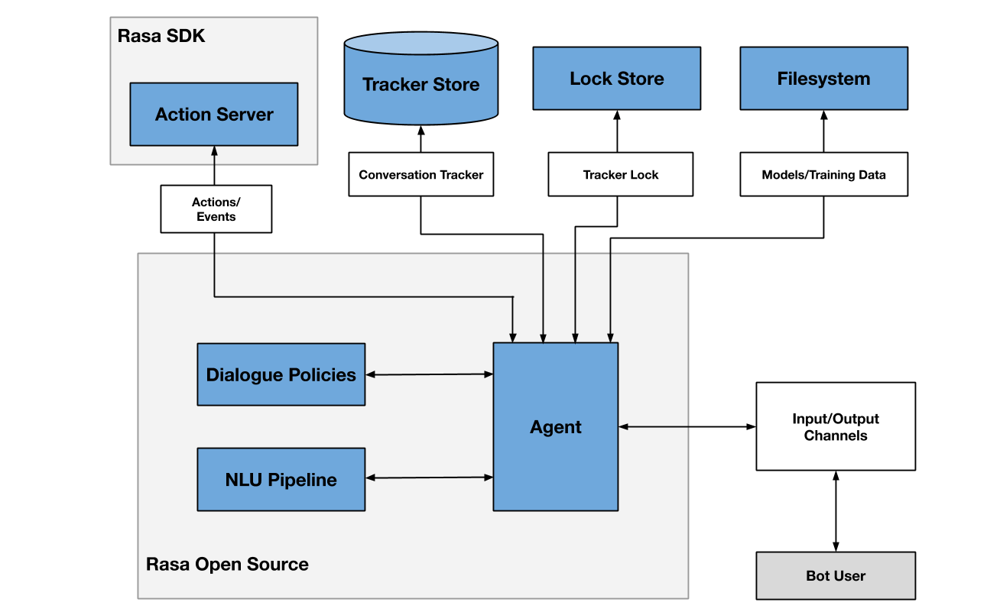
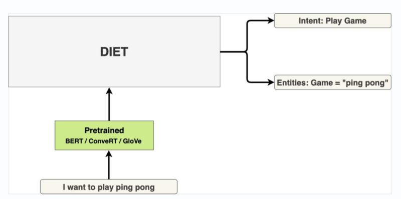
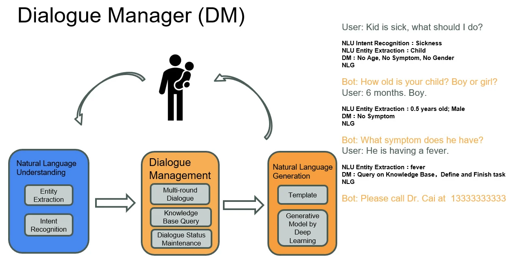

# Rasa Chatbot Hackathon
Here are the files for creating the chatbot model.  

## Using Docker for Rasa
[Building a Rasa Assistant in Docker](https://rasa.com/docs/rasa/docker/building-in-docker/)

```
$ docker -v

$ mkdir Docker

$ cd ~/Docker

$ mkdir rasa

$ cd rasa
```

## Windows using Docker Desktop and Gitbash
Instructions can be found here: 
[Installing Docker on Windows](https://docs.docker.com/desktop/install/windows-install/)

In order to get Rasa Docker working, you need a number of additional values.

To get your userid
```
$ id -u Firstname.Lastname
```

To get your groupid
```
$ id -g Firstname.Lastname
```

To get the current directory where you are installing Rasa docker to format should be "c/Users/Firstname.Lastname/dockerdirectory" if there are spaces in the path, make sure to use quotation marks
```
$ pwd
```

The **--mount src="/c/Users/Firstname.Lastname/pathtorasa/",dst=/app,type=bind** parameter in the commands binds your local directory to the docker containers path, so docker must run with you as the owner in order for you to be able to write/edit files in this bound directory.  If you don't include this, you will not be able to save changes to any of the files in this directory and the training will also fail.

To setup Rasa for the first time
```
docker run -u 1089705:1049089 --mount src="/c/Users/Firstname.Lastname/pathtorasa/",dst=/app,type=bind rasa/rasa:3.2.6-full init --no-prompt
```

To train Rasa 
```
docker run -u 1089705:1049089 --mount src="/c/Users/Richard.Torzynski/Docker/rasa/",dst=/app,type=bind rasa/rasa:3.2.6-full train --domain domain.yml --data data --out models
```

To use Rasa Shell and custom actions, add a new network
```
docker network create my-project
```

To use Rasa Shell, make sure to add winpty before the command or you'll get an error
```
$ winpty docker run -u 1089705:1049089 -it --mount src="/c/Users/Richard.Torzynski/Docker/rasa/",dst=/app,type=bind -p 5005:5005 --net my-project rasa/rasa:3.2.6-full shellgit 
```

To use custom actions, need to start the Rasa Action Server
```
docker run -u 1089705:1049089 -d --mount src="/c/Users/Richard.Torzynski/Docker/rasa/actions/",dst=/app/actions,type=bind --net my-project --name action-server rasa/rasa-sdk:3.2.0
```

## Docker commands

Stop the action server
```
docker stop action-server
```

List running docker containers
```
docker ps
```

List local docker images
```
docker images
```

Remove local docker image
```
docker rm image image-to-remove
```

Stop docker container
```
docker stop [container-id]
docker stop [container-name]
```

## Git Commands

Initialize the local Git repository
```
git init
```

Connect to the Rasa Chatbot Hackathon Repo
```
git remote add origin https://github.com/ecsricktorzynski/rasa-chatbot-hackathon.git
```

Check to see if connection made
```
git remote -v
```

Create a docker branch
git checkout -b docker


Create a main branch
git checkout -b main


### The following works on Windows, but running WSL2 Ubuntu
I'm a big fan of WSL2 as it allows me to work both on Windows and Ubuntu and
communicate easily between the two

add the -u 1000:1000 to run the docker container as default username
to get uid: cat /etc/group

This command will get the docker container rasa/rasa and setup initial project
```
docker run -u 1000:1000 -v $(pwd):/app rasa/rasa:3.2.6-full init --no-prompt
```

Train your model
```
docker run -u 1000:1000 -v $(pwd):/app rasa/rasa:3.2.6-full train
```

Create a network (we will use this later on but needed for shell)
```
docker network create my-project
```

Talk to bot using shell command
```
docker run -u 1000:1000 -it -v $(pwd):/app -p 5005:5005 --net my-project rasa/rasa:3.2.6-full shell
```

Start up action server
```
docker run -u 1000:1000 -d -v $(pwd)/actions:/app/actions --net my-project --name action-server rasa/rasa-sdk:3.2.1
```

To run as a server for drupal
```
docker run -u 1000:1000 -it -v $(pwd):/app -p "5005:5005" --net my-project rasa/rasa:3.2.6-full run -m models --enable-api --cors "*" --debug
```

## Docker commands

Stop the action server
```
docker stop action-server
```

List running docker containers
```
docker ps
```

List local docker images
```
docker images
```

Remove local docker image
```
docker rm image image-to-remove
```

Stop docker container
```
$ docker stop [container-id]
$ docker stop [container-name]
```

The -v option maps the current directory to the /app directory inside the Rasa
Docker container.  This is just a simplier command to --mount that has to be used on Windows. So to make changes, just change the files in this directory.

## Installation Instructions for Linux or WSL2 (Ubuntu on Windows using Windows Subsystem for Linux)

[Rasa open source installation instructions](https://rasa.com/docs/rasa/installation/)

```
$ git clone https://github.com/ecsricktorzynski/rasa-chatbot-hackathon
$ cd rasa-chatbot-hackathon

$ python3 -m venv ./venv
$ source ./venv/bin/activate
(venv)$ pip3 install -U pip

(venv)$ pip3 install rasa

# Add neo4j connectivity
(venv)$ pip3 install neo4j

# don't train an initial module
(venv)$ rasa init

(venv)$ git restore config.yml
```

## Starting Rasa server
```
$ source ./venv/bin/activate
$ rasa run --enable-api --model ./models --endpoints ./endpoints.yml --cors "*"
```

## Starting Rasa Action server
If custom actions are being used, then a separate rasa action server has to be started to handle actions.

```
# open separate terminal
$ source ./venv/bin/activate
$ rasa run actions
```

## Rasa Commands
```
# to create new chatbot
(venv)$ rasa init

# train chatbot after changes
(venv)$ rasa train

# run chatbot in shell
(venv)$ rasa shell

# run chatbot as a service
(venv)$ rasa run --enable-api --model ./models --endpoints ./endpoints.yml --cors "*"

# show help
(venv)$ rasa -h

# show extra log output when debugging
(venv)$ rasa --debug

```

## Rasa File Structure


## Rasa Architecture



## Rasa NLU


## Rasa DIET
Rasa's Dual Intent Entity Transformer (DIET) technology is used for entity extraction and intent recognition.



## Rasa Dialogue Manager (DM)



## Additional Resources
[Rasa Documentation](https://rasa.com/docs/)

[Rasa Learning Center](https://learning.rasa.com/)

This is documentation for developers providing good explanations of NLP and explaining Transformers in a relatively simple way.

[Rasa YouTube Channel](https://www.youtube.com/channel/UCJ0V6493mLvqdiVwOKWBODQ)

# Tasks for talk

1. Install Rasa
2. Train Rasa model
3. Use Rasa shell to talk to chatbot
4. Add Intents and Entities
6. Add a Form 
7. Add a Form with text slots
8. Add a custom action to get current time
9. Add a custom action with confirmation
10. Add hackathon custom actions

If you have any questions, contact Rick Torzynski


